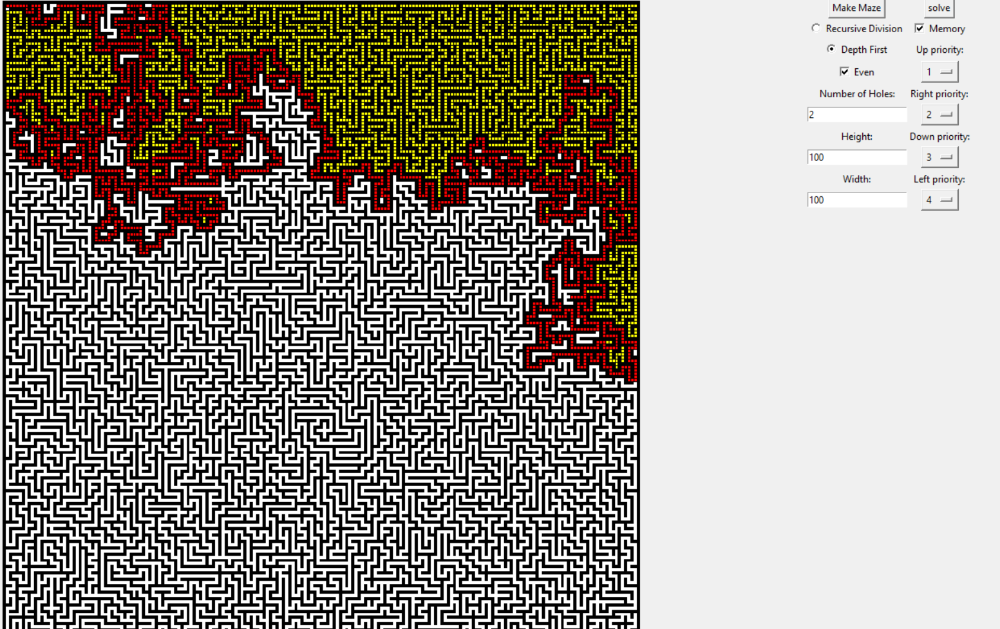

# Maze Algorithms 
Maze Generation Algorithms:
- Recursive Randomized depth-first search
- Randomized Prim's algorithm
- Recursive division method

Maze Solving Algorithms:
- BFS/DFS
- A*

## Command
```sh
python main.py
```

